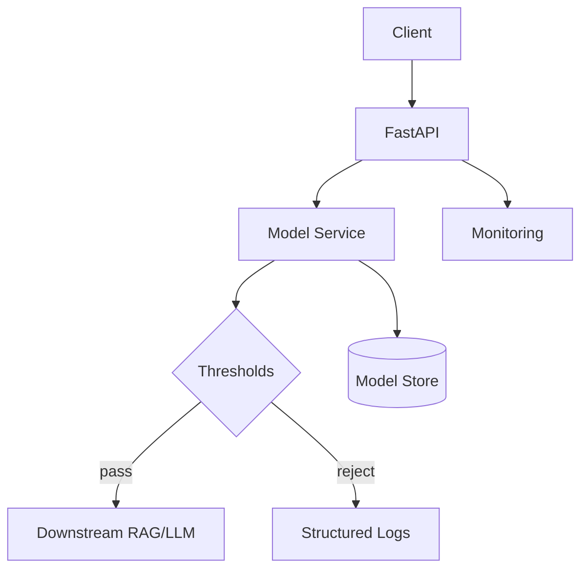

# Step 10 — Deployment Architecture

Reference: `https://docs.google.com/document/d/1rChOwLfyqGnaobRxRNCCuE68UuOTyOgJ/edit?tab=t.0`

This directory contains the production deployment architecture for the Chatbot Filtration System.

## Components
- app/: FastAPI service exposing `/healthz` and `/classify_prompt`
- service/: model service abstraction and decision logic
- curation/: tools and state for analyst-in-the-loop balanced updates (100/100/100)
- scripts/: deployment utilities
- tests/: smoke and load test placeholders

## Diagram

## Next Steps
- Fill Model Service with real model loader from `7-Experiment_With_Models`
- Configure thresholds via env vars
- Build Docker image and run compose
