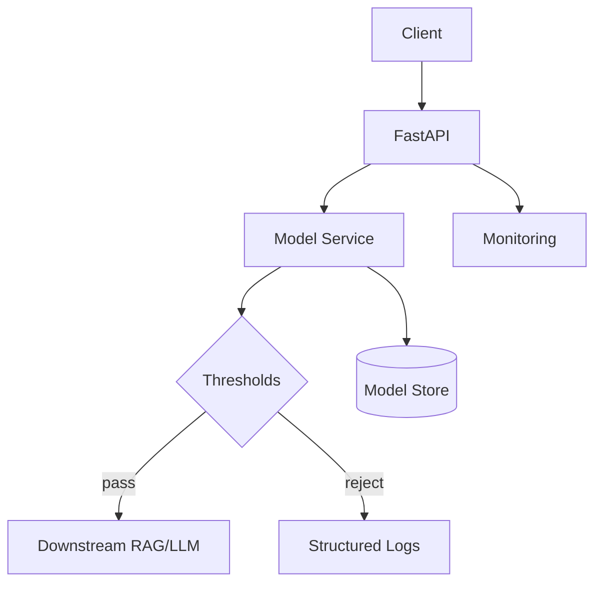

# Step 10 — Deployment Architecture

Reference: `https://docs.google.com/document/d/1rChOwLfyqGnaobRxRNCCuE68UuOTyOgJ/edit?tab=t.0`

This directory contains the production deployment architecture for the Chatbot Filtration System.

## Components
- app/: FastAPI service exposing `/healthz` and `/classify_prompt`
- service/: model service abstraction and decision logic
- curation/: tools and state for analyst-in-the-loop balanced updates (100/100/100)
- scripts/: deployment utilities
- tests/: smoke and load test placeholders

## Diagram


## Quickstart
1) Create venv and install:
```
python3 -m venv .venv && source .venv/bin/activate
pip install -r requirements.txt httpx
```
2) Start API (optional env):
```
# Optional: export HF_MODEL_ID=distilroberta-base
# Optional: export BLOCK_LABELS=red,yellow  # default: red
# Optional: export DOWNSTREAM_URL=http://127.0.0.1:8001/respond
python scripts/run_local.sh
```
3) Start downstream mock (new terminal):
```
uvicorn app.downstream_mock:app --host 0.0.0.0 --port 8001
```
4) Test:
```
curl -s localhost:8000/healthz
curl -s -X POST localhost:8000/classify_prompt -H 'Content-Type: application/json' -d '{"prompt":"Hello"}'
curl -s -X POST localhost:8000/gateway -H 'Content-Type: application/json' -d '{"prompt":"Hello"}'
```

## Configuration
- BLOCK_LABELS: comma-separated labels to block before downstream. Values: `green`, `yellow`, `red`. Default: `red`.
- SUSPICIOUS_PASS_THRESHOLD: float [0,1]. If `label==yellow` and score >= threshold → reject.
- DOWNSTREAM_URL: where `/gateway` forwards on PASS. Default: `http://127.0.0.1:8001/respond`.

## Notes
- Model service will use stub unless `HF_MODEL_ID` is set to a valid HF model id.
