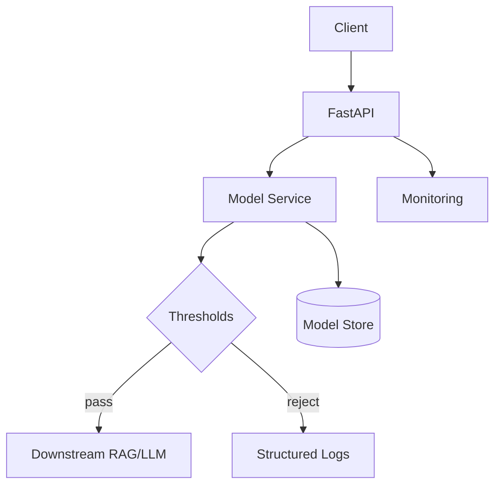

# Step 10 — Deployment Architecture

Reference: `https://docs.google.com/document/d/1rChOwLfyqGnaobRxRNCCuE68UuOTyOgJ/edit?tab=t.0`

This directory contains the production deployment architecture for the Chatbot Filtration System.

## Components
- app/: FastAPI service exposing `/healthz` and `/classify_prompt`
- service/: model service abstraction and decision logic
- curation/: tools and state for analyst-in-the-loop balanced updates (100/100/100)
- scripts/: deployment utilities
- tests/: smoke and load test placeholders

## Diagram


## Quickstart
1) Create venv and install:
```
python3 -m venv .venv && source .venv/bin/activate
pip install -r requirements.txt httpx
```
2) Start API (optional env):
```
# Optional: export HF_MODEL_ID=distilroberta-base
# Optional: export BLOCK_LABELS=red,yellow  # default: red
# Optional: export DOWNSTREAM_URL=http://127.0.0.1:8001/respond
python scripts/run_local.sh
```
3) Start downstream mock (new terminal):
```
uvicorn app.downstream_mock:app --host 0.0.0.0 --port 8001
```
4) Test:
```
curl -s localhost:8000/healthz
curl -s -X POST localhost:8000/classify_prompt -H 'Content-Type: application/json' -d '{"prompt":"Hello"}'
curl -s -X POST localhost:8000/gateway -H 'Content-Type: application/json' -d '{"prompt":"Hello"}'
```

## Configuration
- BLOCK_LABELS: comma-separated labels to block before downstream. Values: `green`, `yellow`, `red`. Default: `red`.
- SUSPICIOUS_PASS_THRESHOLD: float [0,1]. If `label==yellow` and score >= threshold → reject.
- DOWNSTREAM_URL: where `/gateway` forwards on PASS. Default: `http://127.0.0.1:8001/respond`.
- INGEST_UI: if `true` (default), prompts sent via `/classify_prompt` and `/ui_classify` are stored in the curation pending queue.

## Notes
- Model service will use stub unless `HF_MODEL_ID` is set to a valid HF model id.

## Curation API
- POST `/ingest` `{ "prompt": string }`
  - Enqueues into `curation/pending.jsonl` (cap 1,000). Returns id and stats.
- GET `/review/next`
  - Returns next unclassified record and stats.
- POST `/review/{id}` `{ "label": "0|1|2" }`
  - Moves from pending → classified (caps 10,050 per class). Returns record and stats.
- GET `/export/replace`
  - Writes `curation/replace.json` with entries like `{ "user_message": str, "classification": "0|1|2" }` suitable for `5-Data_Wrangling/combined.json` replacement.

## UI — Classification Mode
- At `/ui` you can:
  - Adjust blocking policy & threshold
  - Test classification
  - Switch to “Classification Mode” panel:
    - Load next pending item
    - Label with keyboard: `0/1/2` or `g/y/r`
    - See counters and export `replace.json`

## Manual Reviewer GUI (alt)
- At `/reviewer` you can:
  - Browse the top N pending prompts as a table
  - Select a row and assign label 0/1/2
  - The list refreshes after each assignment

## EDA & Cleaning for Curation
Open the notebook:

`curation/EDA_Curation_Workflow.ipynb`

What it does:
- Loads `curation/classified.jsonl` and `curation/pending.jsonl`
- Applies the same sanitizer used in training (`7-Experiment_With_Models/utils/sanitizer.py`)
- Shows class balance/length histograms
- De-duplicates and trims extreme lengths
- Optionally balances a 100/100/100 slice for replacement
- Exports `curation/replace.cleaned.json` in training-compatible format
- Saves figures in `curation/visuals/`:
  - `curation_overview.png` (label distribution, char lengths, word counts)
  - `wordcount_by_class.png` (overlaid per-class word counts)

Quickstart in notebook:
1) Run labeling in `/ui` or `/reviewer`
2) Open the notebook and run all cells
3) Use the produced `replace.cleaned.json` to feed your retraining pipeline
